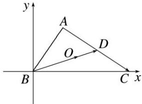

> [!faq]- 《专题2 平面向量的数量积-平面向量》例题解析
>
> > [!success]- **【答案】** 详见解析
>
> > [!note]- **【解析】**
> > 答案 5 解析 如图所示，以 B 为坐标原点，BC 所在直线为 x 轴，建立平面直角坐标系.
> >
> > 
> >
> > $\because AB = 1, \angle ABC = 60^{\circ}, \therefore A\left(\frac{1}{2}, \frac{\sqrt{3}}{2}\right)$ . 设 $C(a, 0)$ . $\because \overrightarrow{AC} \cdot \overrightarrow{AB} = -1, \therefore \left(a - \frac{1}{2}, -\frac{\sqrt{3}}{2}\right) \cdot \left(-\frac{1}{2}, -\frac{\sqrt{3}}{2}\right) = -\frac{1}{2}\left(a - \frac{1}{2}\right) + \frac{3}{4} = -1$ , 解得 $a = 4$ . $\because O$ 是 $\triangle ABC$ 的重心, 延长 $BO$ 交 $AC$ 于点 $D$ , $\therefore \overrightarrow{BO} = \frac{2}{3}\overrightarrow{BD} = \frac{2}{3} \times \frac{1}{2} (\overrightarrow{BA} + \overrightarrow{BC}) = \frac{1}{3}\left[\left(\frac{1}{2}, \frac{\sqrt{3}}{2}\right) + (4, 0)\right] = \left(\frac{3}{2}, \frac{\sqrt{3}}{6}\right)$ . $\therefore \overrightarrow{BO} \cdot \overrightarrow{AC} = \left(\frac{3}{2}, \frac{\sqrt{3}}{6}\right) \cdot \left(\frac{7}{2}, -\frac{\sqrt{3}}{2}\right) = 5$ .
