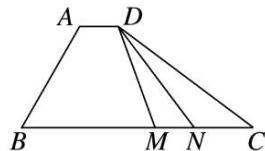

<!-- question-source:start -->
(6)(2020·天津)如图，在四边形ABCD中， $\angle B=60^{\circ}$ ， $AB=3$ ， $BC=6$ ，且 $\overrightarrow{AD}=\lambda\overrightarrow{BC}$ ， $\overrightarrow{AD}\cdot\overrightarrow{AB}=-\frac{3}{2}$ ，则实数 $\lambda$ 的值为\_\_\_\_，若M，N是线段BC上的动点，且 $|\overrightarrow{MN}|=1$ ，则 $\overrightarrow{DM}\cdot\overrightarrow{DN}$ 的最小值为\_\_\_\_。

<!-- question-source:end -->

![[高中/总复习/专题/平面向量/专题2 平面向量的数量积-平面向量/考点03_平面向量数量积的最值_范围_问题/例题/answers/Q00045157A1.md]]
