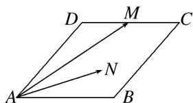

<!-- question-source:start -->
10. 如图, 菱形 $ABCD$ 的边长为 2 , $\angle BAD = 60^{\circ}$ , $M$ 为 $DC$ 的中点, 若 $N$ 为菱形内任意一点 (含边界), 则 $\overrightarrow{AM} \cdot \overrightarrow{AN}$ 的最大值为 \_\_\_\_.

<!-- question-source:end -->

![[高中/总复习/专题/平面向量/专题2 平面向量的数量积-平面向量/考点03_平面向量数量积的最值_范围_问题/对点训练/answers/Q00045169A1.md]]
