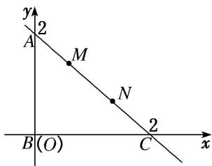

> [!faq]- 《专题2 平面向量的数量积-平面向量》例题解析
>
> > [!success]- **【答案】** A
>
> > [!note]- **【解析】**
> > 答案 C 解析 以等腰直角三角形的直角边 BC 所在直线为 x 轴，BA 所在直线为 y 轴，建立平面直角坐标系如图所示，则 $B(0, 0)$ ，直线 $AC$ 的方程为 $x + y = 2$ ，设 $M(a, 2 - a)$ ，则 $0 < a < 1$ ， $N(a + 1, 1 - a)$ ， $\therefore \overrightarrow{BM} = (a, 2 - a), \overrightarrow{BN} = (a + 1, 1 - a)$ ， $\therefore \overrightarrow{BM} \cdot \overrightarrow{BN} = a(a + 1) + (2 - a)(1 - a) = 2a^2 - 2a + 2$ ， $\because 0 < a < 1$ ， $\therefore$ 当 $a = \frac{1}{2}$ 时， $\overrightarrow{BM} \cdot \overrightarrow{BN}$ 取得最小值 $\frac{3}{2}$ ，又 $\overrightarrow{BM} \cdot \overrightarrow{BN} < 2$ ，故 $\overrightarrow{BM} \cdot \overrightarrow{BN}$ 的取值范围为 $\left[\frac{3}{2}, 2\right]$ .
> >
> > 
