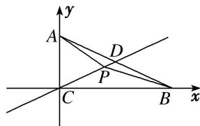

> [!faq]- 《专题2 平面向量的数量积-平面向量》例题解析
>
> > [!success]- **【答案】** C
>
> > [!note]- **【解析】**
> > 答案 C 解析 由 $\overrightarrow{AP} = \frac{1}{a}\overrightarrow{AC} +\frac{a - 1}{a}\overrightarrow{AD}$ 知点 $P$ 在直线 $CD$ 上，以点 $C$ 为坐标原点， $CB$ 所在直线为 $x$ 轴， $CA$ 所在直线为 $y$ 轴建立如图所示的平面直角坐标系，则 $C(0,0), A(0,2), B(2\sqrt{3},0), D(\sqrt{3},$
> >
> > 1), $\therefore$ 直线 $CD$ 的方程为 $y = \frac{\sqrt{3}}{3} x$ , 设 $P\left(x, \frac{\sqrt{3}}{3} x\right)$ , 则 $\overrightarrow{PA} = \left(-x, 2 - \frac{\sqrt{3}}{3} x\right)$ , $\overrightarrow{PB} = \left(2\sqrt{3} - x, -\frac{\sqrt{3}}{3} x\right)$ , $\overrightarrow{PC} = \left(-x, -\frac{\sqrt{3}}{3} x\right)$ , $\therefore \overrightarrow{PB} + \overrightarrow{PC} = \left(2\sqrt{3} - 2x, -\frac{2\sqrt{3}}{3} x\right)$ , $\therefore \overrightarrow{PA} \cdot (\overrightarrow{PB} + \overrightarrow{PC}) = -x (2\sqrt{3} - 2x) + \frac{2}{3} x^2 - \frac{4\sqrt{3}}{3} x = \frac{8}{3} x^2 - \frac{10\sqrt{3}}{3} x = \frac{8}{3}\left(x - \frac{5\sqrt{3}}{8}\right)^2 - \frac{25}{8}$ , $\therefore$ 当 $x = \frac{5\sqrt{3}}{8}$ 时, $\overrightarrow{PA} \cdot (\overrightarrow{PB} + \overrightarrow{PC})$ 取得最小值 $-\frac{25}{8}$ .
> >
> > 
