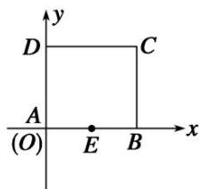
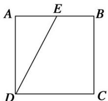

> [!faq]- 《专题2 平面向量的数量积-平面向量》例题解析
>
> > [!success]- **【答案】** 详见解析
>
> > [!note]- **【分析】**
> > 本题未单列分析。
>
> > [!note]- **【解析】**
> > 答案 1 1 解析 方法一 以射线 AB, AD 为 x 轴, y 轴的正方向建立平面直角坐标系, 则 A(0, 0), B(1, 0), C(1, 1), D(0, 1), 设 E(t, 0), t ∈ [0, 1], 则 $\overrightarrow{DE} = (t, -1)$ , $\overrightarrow{CB} = (0, -1)$ , 所以 $\overrightarrow{DE} \cdot \overrightarrow{CB} = (t, -1) \cdot (0, -1) = 1$ . 因为 $\overrightarrow{DC} = (1, 0)$ , 所以 $\overrightarrow{DE} \cdot \overrightarrow{DC} = (t, -1) \cdot (1, 0) = t \leqslant 1$ , 故 $\overrightarrow{DE} \cdot \overrightarrow{DC}$ 的最大值为 1.
> > 
> > 方法二 由图知，无论 E 点在哪个位置， $\overrightarrow{DE}$ 在 $\overrightarrow{CB}$ 方向上的投影都是 CB=1， $\therefore\overrightarrow{DE}\cdot\overrightarrow{CB}=|\overrightarrow{CB}|\cdot1=1$ ，当 E 运动到 B 点时， $\overrightarrow{DE}$ 在 $\overrightarrow{DC}$ 方向上的投影最大即为 DC=1， $\therefore(\overrightarrow{DE}\cdot\overrightarrow{DC})_{\max}=|\overrightarrow{DC}|\cdot1=1$ .
> > 
