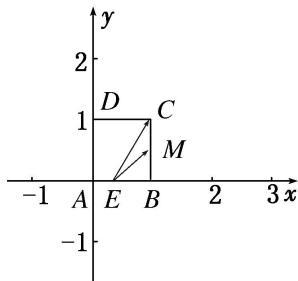

> [!faq]- 《专题2 平面向量的数量积-平面向量》例题解析
>
> > [!success]- **【答案】** A
>
> > [!note]- **【解析】**
> > 答案 C 解析 将正方形放入如图所示的平面直角坐标系中，设 $E(x,0)$ ， $0 \leqslant x \leqslant 1$ 。又 $M\left(1,\frac{1}{2}\right)$ ， $C(1,1)$ ，所以 $\overrightarrow{EM} = \left(1 - x, \frac{1}{2}\right)$ ， $\overrightarrow{EC} = (1 - x, 1)$ ，所以 $\overrightarrow{EM} \cdot \overrightarrow{EC} = \left(1 - x, \frac{1}{2}\right) \cdot (1 - x, 1) = (1 - x)^2 + \frac{1}{2}$ 。因为 $0 \leqslant x \leqslant 1$ ，所以 $\frac{1}{2} \leqslant (1 - x)^2 + \frac{1}{2} \leqslant \frac{3}{2}$ ，即 $\overrightarrow{EM} \cdot \overrightarrow{EC}$ 的取值范围是 $\left[\frac{1}{2}, \frac{3}{2}\right]$ 。
> >
> > 
