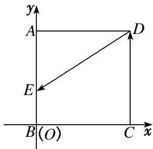

> [!faq]- 《专题2 平面向量的数量积-平面向量》例题解析
>
> > [!success]- **【答案】** 详见解析
>
> > [!note]- **【分析】**
> > 本题未单列分析。
>
> > [!note]- **【解析】**
> > 答案 $[-1, 0]$ 解析 以 $BC$ , $BA$ 所在的直线为 $x$ 轴, $y$ 轴, 建立平面直角坐标系如图所示, 可得 $A(0, 1)$ , $B(0, 0)$ , $C(1, 0)$ , $D(1, 1)$ . 当 $E$ 在 $DA$ 上时, 设 $E(x, 1)$ , 其中 $0 \leq x \leq 1$ , $\because \overrightarrow{DE} = (x - 1, 0)$ , $\overrightarrow{CD} = (0, 1)$ , $\therefore \overrightarrow{DE} \cdot \overrightarrow{CD} = 0$ ; 当 $E$ 在 $AB$ 上时, 设 $E(0, y)$ , 其中 $0 \leq y \leq 1$ , $\because \overrightarrow{DE} = (-1, y - 1)$ , $\overrightarrow{CD} = (0, 1)$ , $\therefore \overrightarrow{DE} \cdot \overrightarrow{CD} = y - 1 (0 \leq y \leq 1)$ , 此时 $\overrightarrow{DE} \cdot \overrightarrow{CD}$ 的取值范围为 $[-1, 0]$ ; 当 $E$ 在 $BC$ 上时, 设 $E(x, 0)$ , 其中 $0 \leq x \leq 1$ , $\because \overrightarrow{DE} = (x - 1, -1)$ , $\overrightarrow{CD} = (0, 1)$ , $\therefore \overrightarrow{DE} \cdot \overrightarrow{CD} = -1$ . 综上所述, $\overrightarrow{DE} \cdot \overrightarrow{CD}$ 的取值范围为 $[-1, 0]$ .
> >
> > 
