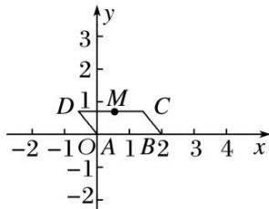

> [!faq]- 《专题2 平面向量的数量积-平面向量》例题解析
>
> > [!success]- **【答案】** 详见解析
>
> > [!note]- **【分析】**
> > 本题未单列分析。
>
> > [!note]- **【解析】**
> > 答案 2 解析 在平行四边形 ABCD 中，因为 AB=2, AD=1, $\overrightarrow{AB}\cdot\overrightarrow{AD}=-1$ ，点 M 在边 CD 上，所以 $|\overrightarrow{AB}|\cdot|\overrightarrow{AD}|\cdot\cos A=-1$ ，所以 $\cos A=-\frac{1}{2}$ ，所以 $A=120^{\circ}$ ，以 A 为坐标原点，AB 所在的直线为 x 轴，AB 的垂线为 y 轴，建立如图所示的平面直角坐标系，
> > 
> > 所以 $A(0,0)$ , $B(2,0)$ , $D\left(-\frac{1}{2}, \frac{\sqrt{3}}{2}\right)$ . 设 $M\left(x, \frac{\sqrt{3}}{2}\right)$ , $-\frac{1}{2} \leq x \leq \frac{3}{2}$ , 因为 $\overrightarrow{MA} = \left(-x, -\frac{\sqrt{3}}{2}\right)$ , $\overrightarrow{MB} = \left(2 - x, -\frac{\sqrt{3}}{2}\right)$ ,
> > 所以 $\overrightarrow{MA}\cdot\overrightarrow{MB}=x(x-2)+\frac{3}{4}=x^{2}-2x+\frac{3}{4}=(x-1)^{2}-\frac{1}{4}$ . 设 $f(x)=(x-1)^{2}-\frac{1}{4}$ ，因为 $x\in\left[-\frac{1}{2},\frac{3}{2}\right]$ ，所以当 x=- $\frac{1}{2}$ 时， $f(x)$ 取得最大值2.
