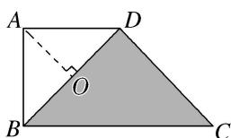

> [!faq]- 《专题2 平面向量的数量积-平面向量》例题解析
>
> > [!success]- **【答案】** C
>
> > [!note]- **【分析】**
> > 本题未单列分析。
>
> > [!note]- **【解析】**
> > 答案 C 解析 ∵ 在直角梯形 ABCD 中，DA=AB=1, BC=2, ∴ BD=√2．如图所示，过点 A 作 AO⊥BD，垂足为 O，则 $\overrightarrow{PA}=\overrightarrow{PO}+\overrightarrow{OA},\quad\overrightarrow{OA}\cdot\overrightarrow{BD}=0,\quad\therefore\overrightarrow{PA}\cdot\overrightarrow{BD}=(\overrightarrow{PO}+\overrightarrow{OA})\cdot\overrightarrow{BD}=\overrightarrow{PO}\cdot\overrightarrow{BD}$ ∴ 当点 P 与点 B 重合时， $\overrightarrow{PA}\cdot\overrightarrow{BD}$ 取得最大值，即 $\overrightarrow{PA}\cdot\overrightarrow{BD}=\overrightarrow{PO}\cdot\overrightarrow{BD}=\frac{1}{2}\times\sqrt{2}\times\sqrt{2}=1$ ；当点 P 与点 D 重合时， $\overrightarrow{PA}\cdot\overrightarrow{BD}$ 取得最小值，即 $\overrightarrow{PA}\cdot\overrightarrow{BD}=-\frac{1}{2}\times\sqrt{2}\times\sqrt{2}=-1$ ∴ $\overrightarrow{PA}\cdot\overrightarrow{BD}$ 的取值范围是 [-1, 1].
> > 
