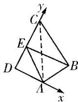

> [!faq]- 《专题2 平面向量的数量积-平面向量》例题解析
>
> > [!success]- **【答案】** 详见解析
>
> > [!note]- **【分析】**
> > 本题未单列分析。
>
> > [!note]- **【解析】**
> > 答案 $\frac{21}{16}$ 解析 如图，以 $D$ 为坐标原点建立直角坐标系。连接 $AC$ ，由题意知 $\angle CAD = \angle CAB = 60^\circ$ ， $\angle ACD = \angle ACB = 30^\circ$ ，则 $D(0,0), A(1,0), B\left(\frac{3}{2}, \frac{\sqrt{3}}{2}\right), C(0, \sqrt{3})$ 。设 $E(0, y)(0 \leqslant y \leqslant \sqrt{3})$ ，则 $\overrightarrow{AE} = (-1, y), \overrightarrow{BE} = \left(-\frac{3}{2}, y - \frac{\sqrt{3}}{2}\right)$ ，所以 $\overrightarrow{AE} \cdot \overrightarrow{BE} = \frac{3}{2} + y^2 - \frac{\sqrt{3}}{2}y = \left(y - \frac{\sqrt{3}}{4}\right)^2 + \frac{21}{16}$ ，所以当 $y = \frac{\sqrt{3}}{4}$ 时， $\overrightarrow{AE} \cdot \overrightarrow{BE}$ 有最小值 $\frac{21}{16}$ 。
> >
> > 
