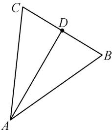

<!-- question-source:start -->
(3)如图，已知非零向量 $\overrightarrow{AB}$ 与 $\overrightarrow{AC}$ 满足 $(\frac{\overrightarrow{AB}}{|\overrightarrow{AB}|} +\frac{\overrightarrow{AC}}{|\overrightarrow{AC}|})\cdot \overrightarrow{BC} = 0$ ，且 $|\overrightarrow{AB} -\overrightarrow{AC}| = 2\sqrt{3}$ ， $|\overrightarrow{AB} +\overrightarrow{AC}| = 2\sqrt{6}$ ，点 $D$ 是 $\triangle ABC$ 中边 $BC$ 的中点，则 $\overrightarrow{AB}\cdot \overrightarrow{BD} = \_$ .

<!-- question-source:end -->

![[高中/总复习/专题/平面向量/专题2 平面向量的数量积-平面向量/考点一_求平面向量数量积/例题选讲/例题/answers/Q00033297A1.md]]
