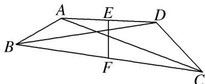
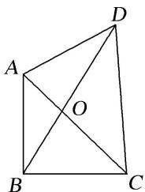

<!-- question-source:start -->
(12)如图，在四边形 ABCD 中，点 E, F 分别是边 AD, BC 的中点，设 $\overrightarrow{AD} \cdot \overrightarrow{BC} = m$ , $\overrightarrow{AC} \cdot \overrightarrow{BD} = n$ . 若 AB = $\sqrt{2}$ , EF = 1, $CD = \sqrt{3}$ ，则()

A. $2m - n = 1$ B. $2m - 2n = 1$ C. $m - 2n = 1$ D. $2n - 2m = 1$

$$
\overrightarrow {A C} \cdot \overrightarrow {B D} = (\overrightarrow {A B} + \overrightarrow {B C}) \cdot (- \overrightarrow {A B} + \overrightarrow {A D}) = - \overrightarrow {A B ^ {2}} + \overrightarrow {A B} \cdot \overrightarrow {A D} - \overrightarrow {A B} \cdot \overrightarrow {B C} + \overrightarrow {A D} \cdot \overrightarrow {B C} = - \overrightarrow {A B ^ {2}} +
$$

$\overrightarrow{AB} \cdot (\overrightarrow{AD} - \overrightarrow{BC}) + m = -\overrightarrow{AB}^2 + \overrightarrow{AB} \cdot (\overrightarrow{AB} + \overrightarrow{BC} + \overrightarrow{CD} - \overrightarrow{BC}) + m = \overrightarrow{AB} \cdot \overrightarrow{CD} + m.$ 又 $\overrightarrow{EF} = \overrightarrow{EA} + \overrightarrow{AB} + \overrightarrow{BF}, \overrightarrow{EF} = \overrightarrow{ED} + \overrightarrow{DC}$ $+\overrightarrow{CF}$ ，两式相加，再根据点 $E$ ， $F$ 分别是边 $AD$ ， $BC$ 的中点，化简得 $2\overrightarrow{EF} = \overrightarrow{AB} + \overrightarrow{DC}$ ，两边同时平方得 $4 = 2 + 3 + 2\overrightarrow{AB} \cdot \overrightarrow{DC}$ ，所以 $\overrightarrow{AB} \cdot \overrightarrow{DC} = -\frac{1}{2}$ ，则 $\overrightarrow{AB} \cdot \overrightarrow{CD} = \frac{1}{2}$ ，所以 $n = \frac{1}{2} + m$ ，即 $2n - 2m = 1$ ，故选 D.

(13)(2017·浙江)如图，已知平面四边形 ABCD， $AB \perp BC$ ，AB = BC = AD = 2，CD = 3，AC 与 BD 交于点 O．记 $I_{1} = \overrightarrow{OA} \cdot \overrightarrow{OB}$ ， $I_{2} = \overrightarrow{OB} \cdot \overrightarrow{OC}$ ， $I_{3} = \overrightarrow{OC} \cdot \overrightarrow{OD}$ ，则()

A. $I_{1} <   I_{2} <   I_{3}$ B. $I_{1} <   I_{3} <   I_{2}$ C. $I_{3} <   I_{1} <   I_{2}$ D. $I_{2} <   I_{1} <   I_{3}$
<!-- question-source:end -->

![[高中/总复习/专题/平面向量/专题2 平面向量的数量积-平面向量/考点一_求平面向量数量积/例题选讲/例题/answers/Q00033306A1.md]]
