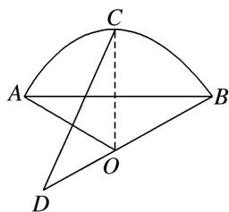

> [!faq]- 教师版例题解析
>
> > [!success]- **【答案】** C
>
> > [!note]- **【分析】**
> > 本题未单列分析。
>
> > [!note]- **【解析】**
> > 答案 C 解析 如图, 连接 $CO$ , $\because$ 点 $C$ 是弧 $AB$ 的中点, $\therefore CO \perp AB$ , 又 $\because OA = OB = 2$ , $\overrightarrow{OD} = -\frac{1}{2}\overrightarrow{OB}$ , $\angle AOB = \frac{2\pi}{3}$ , $\therefore \overrightarrow{CD} \cdot \overrightarrow{AB} = (\overrightarrow{OD} - \overrightarrow{OC}) \cdot \overrightarrow{AB} = -\frac{1}{2}\overrightarrow{OB} \cdot \overrightarrow{AB} = -\frac{1}{2}\overrightarrow{OB} \cdot (\overrightarrow{OB} - \overrightarrow{OA}) = \frac{1}{2}\overrightarrow{OA} \cdot \overrightarrow{OB} - \frac{1}{2}\overrightarrow{OB}^2 = \frac{1}{2} \times 2 \times 2 \times \left(-\frac{1}{2}\right) - \frac{1}{2} \times 4 = -3$ .
> > 
