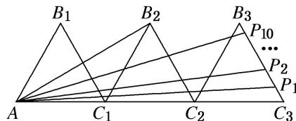

<!-- question-source:start -->
7. 如图, 三个边长为 2 的等边三角形有一条边在同一条直线上, 边 $B_{3}C_{3}$ 上有 10 个不同的点 $P_{1}, P_{2}, \ldots, P_{10}$ , 记 $m_{i} = \overrightarrow{AB_{2}} \cdot \overrightarrow{AP_{i}} (i = 1, 2, \ldots, 10)$ , 则 $m_{1} + m_{2} + \ldots + m_{10}$ 的值为( )

A. 180 B. $60\sqrt{3}$ C. 45 D. $15\sqrt{3}$

7.
<!-- question-source:end -->

![[高中/总复习/专题/平面向量/专题2 平面向量的数量积-平面向量/考点一_求平面向量数量积/对点训练/题目/answers/Q00033314A1.md]]
