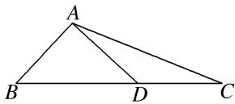

<!-- question-source:start -->
13. 如图，在 $\triangle ABC$ 中， $AD \perp AB$ ， $\overrightarrow{BC} = \sqrt{3}\overrightarrow{BD}$ ， $|\overrightarrow{AD}| = 1$ ，则 $\overrightarrow{AC} \cdot \overrightarrow{AD}$ 的值为（）

A. $2\sqrt{3}$ B. $\frac{\sqrt{3}}{2}$ C. $\frac{\sqrt{3}}{3}$ D. $\sqrt{3}$

13.
<!-- question-source:end -->

![[高中/总复习/专题/平面向量/专题2 平面向量的数量积-平面向量/考点一_求平面向量数量积/对点训练/题目/answers/Q00033320A1.md]]
