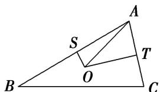

<!-- question-source:start -->
15. 已知 $O$ 是 $\triangle ABC$ 的外心， $|\overrightarrow{AB}| = 4$ ， $|\overrightarrow{AC}| = 2$ ，则 $\overrightarrow{AO} \cdot (\overrightarrow{AB} + \overrightarrow{AC}) = (\quad)$

A. 10 B. 9 C. 8 D. 6

15.
<!-- question-source:end -->

![[高中/总复习/专题/平面向量/专题2 平面向量的数量积-平面向量/考点一_求平面向量数量积/对点训练/题目/answers/Q00033322A1.md]]
