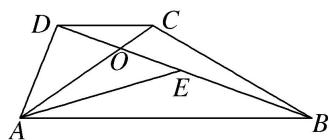

<!-- question-source:start -->
26. 如图, 在四边形 $ABCD$ 中, $AB = 6$ , $AD = 2$ , $\overrightarrow{DC} = \frac{1}{3}\overrightarrow{AB}$ , $AC$ 与 $BD$ 相交于点 $O$ , $E$ 是 $BD$ 的中点, 若 $\overrightarrow{AO} \cdot \overrightarrow{AE} = 8$ , 则 $\overrightarrow{AC} \cdot \overrightarrow{BD} = (\quad)$

A. -9 B. $-\frac{29}{3}$ C. -10 D. $-\frac{32}{3}$

26.
<!-- question-source:end -->

![[高中/总复习/专题/平面向量/专题2 平面向量的数量积-平面向量/考点一_求平面向量数量积/对点训练/题目/answers/Q00033332A1.md]]
