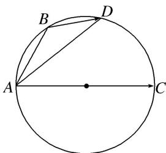

<!-- question-source:start -->
28. 如图, $B$ , $D$ 是以 $AC$ 为直径的圆上的两点, 其中 $AB = \sqrt{t + 1}$ , $AD = \sqrt{t + 2}$ , 则 $\overrightarrow{AC} \cdot \overrightarrow{BD} = (\quad)$ A. 1 B. 2 C. $t$ D. $2t$

28.
<!-- question-source:end -->

![[高中/总复习/专题/平面向量/专题2 平面向量的数量积-平面向量/考点一_求平面向量数量积/对点训练/题目/answers/Q00033334A1.md]]
