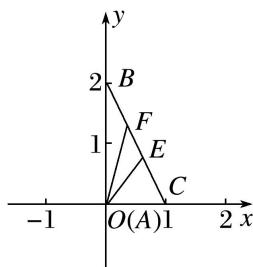

> [!faq]- 教师版对点训练解析
>
> > [!success]- **【答案】** B
>
> > [!note]- **【分析】**
> > 本题未单列分析。
>
> > [!note]- **【解析】**
> > 答案 B 解析 由 $|\overrightarrow{AB}+\overrightarrow{AC}|=|\overrightarrow{AB}-\overrightarrow{AC}|$ ，化简得 $\overrightarrow{AB}\cdot\overrightarrow{AC}=0$ ，又因为AB和AC为三角形的两条边，它们的长不可能为0，所以AB与AC垂直，所以 $\triangle ABC$ 为直角三角形。以A为原点，以AC所在直线为x轴，以AB所在直线为y轴建立平面直角坐标系，如图所示，则 $A(0,0)$ ， $B(0,2)$ ， $C(1,0)$ 。不妨令E为BC的靠近C的三等分点，则 $E\left(\frac{2}{3},\frac{2}{3}\right)$ ， $F\left(\frac{1}{3},\frac{4}{3}\right)$ ，所以 $\overrightarrow{AE}=\left(\frac{2}{3},\frac{2}{3}\right)$ ， $\overrightarrow{AF}=\left(\frac{1}{3},\frac{4}{3}\right)$ ，所以 $\overrightarrow{AE}\cdot\overrightarrow{AF}=\frac{2}{3}\times\frac{1}{3}+\frac{2}{3}\times\frac{4}{3}=\frac{10}{9}$ 。
> > 
