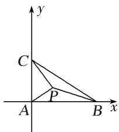

> [!faq]- 教师版对点训练解析
>
> > [!success]- **【答案】** 详见解析
>
> > [!note]- **【分析】**
> > 本题未单列分析。
>
> > [!note]- **【解析】**
> > 答案 -9 解析 $\because \overrightarrow{BA} \cdot \overrightarrow{BC} = |\overrightarrow{BA}| \cdot |\overrightarrow{BC}| \cdot \cos B = |\overrightarrow{BA}|^2, \therefore |\overrightarrow{BC}| \cdot \cos B = |\overrightarrow{BA}| = 6, \therefore \overrightarrow{CA} \perp \overrightarrow{AB}$ , 即 $A = \frac{\pi}{2}$ , 以 $A$ 为坐标原点建立如图所示的坐标系,
> > 
> > 则 $B(6,0)$ ， $C(0,3)$ ，设 $P(x,y)$ ，则 $\overrightarrow{PA}^{2}+\overrightarrow{PB}^{2}+\overrightarrow{PC}^{2}=x^{2}+y^{2}+(x-6)^{2}+y^{2}+x^{2}+(y-3)^{2}=3x^{2}-12x+3y^{2}-6y+45=3[(x-2)^{2}+(y-1)^{2}+10]$ ∴ 当 x=2, y=1 时， $\overrightarrow{PA}^{2}+\overrightarrow{PB}^{2}+\overrightarrow{PC}^{2}$ 取得最小值，此时 $P(2,1)$ ， $\overrightarrow{AP}=(2,1)$ ，此时 $\overrightarrow{AP}\cdot\overrightarrow{BC}=(2,1)\cdot(-6,3)=-9$ .
