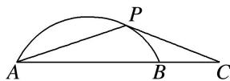

<!-- question-source:start -->
(5)如图，已知 $P$ 是半径为 2，圆心角为 $\frac{\pi}{3}$ 的一段圆弧 $AB$ 上的一点，若 $\overrightarrow{AB} = 2\overrightarrow{B}\overrightarrow{C}$ ，则 $\overrightarrow{PC} \cdot \overrightarrow{PA}$ 的最小值为 \_\_\_\_.

<!-- question-source:end -->

![[高中/总复习/专题/平面向量/专题2 平面向量的数量积-平面向量/考点三_平面向量数量积的最值_范围_问题/例题选讲/例题/answers/Q00033346A1.md]]
