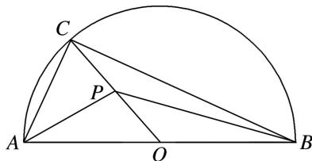

<!-- question-source:start -->
(8)如图所示，半圆的直径 AB=6，O 为圆心，C 为半圆上不同于 A，B 的任意一点，若 P 为半径 OC 上的动点，则 $(\overrightarrow{PA}+\overrightarrow{PB})\cdot\overrightarrow{PC}$ 的最小值为 \_\_\_\_.

<!-- question-source:end -->

![[高中/总复习/专题/平面向量/专题2 平面向量的数量积-平面向量/考点三_平面向量数量积的最值_范围_问题/例题选讲/例题/answers/Q00033349A1.md]]
