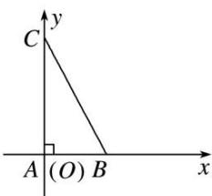

> [!faq]- 教师版例题解析
>
> > [!success]- **【答案】** A
>
> > [!note]- **【分析】**
> > 本题未单列分析。
>
> > [!note]- **【解析】**
> > 答案 A 解析 建立如图所示的平面直角坐标系，则 $B\left(\frac{1}{t}, 0\right)$ ， $C(0, t)$ ， $\overrightarrow{AB} = \left(\frac{1}{t}, 0\right)$ ， $\overrightarrow{AC} = (0, t)$ ， $A\overrightarrow{P} = \frac{\overrightarrow{AB}}{|\overrightarrow{AB}|} + \frac{4\overrightarrow{AC}}{|\overrightarrow{AC}|} = t\left(\frac{1}{t}, 0\right) + \frac{4}{t}(0, t) = (1, 4)$ ， $\therefore P(1, 4)$ ， $\overrightarrow{PB} \cdot \overrightarrow{PC} = \left(\frac{1}{t} - 1, -4\right) \cdot (-1, t - 4) = 17 - \left(\frac{1}{t} + 4t\right) \leq 17$ $-2\sqrt{\frac{1}{t} \cdot 4t} = 13$ ，当且仅当 $t = \frac{1}{2}$ 时等号成立。 $\therefore \overrightarrow{PB} \cdot \overrightarrow{PC}$ 的最大值等于 13.
> > 
