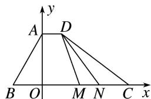

> [!faq]- 教师版例题解析
>
> > [!success]- **【答案】** 详见解析
>
> > [!note]- **【分析】**
> > 本题未单列分析。
>
> > [!note]- **【解析】**
> > 答案 $\frac{1}{6} \frac{13}{2}$ 解析 因为 $\overrightarrow{AD} = \lambda \overrightarrow{BC}$ , 所以 $AD \parallel BC$ , 则 $\angle BAD = 120^{\circ}$ , 所以 $\overrightarrow{AD} \cdot \overrightarrow{AB} = |\overrightarrow{AD}| \cdot |\overrightarrow{AB}| \cdot \cos 120^{\circ} = -\frac{3}{2}$ , 解得 $|\overrightarrow{AD}| = 1$ . 因为 $\overrightarrow{AD}, \overrightarrow{BC}$ 同向, 且 $BC = 6$ , 所以 $\overrightarrow{AD} = \frac{1}{6} \overrightarrow{BC}$ , 即 $\lambda = \frac{1}{6}$ . 在四边形 $ABCD$ 中, 作 $AO \perp BC$ 于点 $O$ , 则 $BO = AB \cdot \cos 60^{\circ} = \frac{3}{2}$ , $AO = AB \cdot \sin 60^{\circ} = \frac{3\sqrt{3}}{2}$ . 以 $O$ 为坐标原点, 以 $BC$ 和 $AO$ 所在直线分别为 $x$ , $y$ 轴建立平面直角坐标系. 如图, 设 $M(a, 0)$ , 不妨设点 $N$ 在点 $M$ 右侧,
> > 
> > 则 $N(a+1,0)$ ，且 $-\frac{3}{2} \leq a \leq \frac{7}{2}$ 。又 $D\left(1, \frac{3\sqrt{3}}{2}\right)$ ，所以 $\overrightarrow{DM} = \left(a - 1, -\frac{3\sqrt{3}}{2}\right)$ ， $\overrightarrow{DN} = \left(a, -\frac{3\sqrt{3}}{2}\right)$ ，所以 $\overrightarrow{DM} \cdot \overrightarrow{DN} = a^{2} - a + \frac{27}{4} = \left(a - \frac{1}{2}\right)^{2} + \frac{13}{2}$ 。所以当 $a = \frac{1}{2}$ 时， $\overrightarrow{DM} \cdot \overrightarrow{DN}$ 取得最小值 $\frac{13}{2}$ 。
