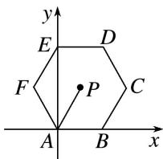
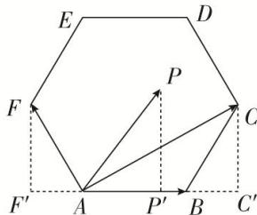

> [!faq]- 教师版例题解析
>
> > [!success]- **【答案】** A
>
> > [!note]- **【分析】**
> > 本题未单列分析。
>
> > [!note]- **【解析】**
> > 答案 A 解析 如图，取 $A$ 为坐标原点， $AB$ 所在直线为 $x$ 轴建立平面直角坐标系，则 $A(0,0)$ ， $B(2,0)$ ， $C(3,\sqrt{3})$ ， $F(-1,\sqrt{3})$ 。设 $P(x,y)$ ，则 $\overrightarrow{AP} = (x,y)$ ， $\overrightarrow{AB} = (2,0)$ ，且 $-1 < x < 3$ 。所以 $\overrightarrow{AP} \cdot \overrightarrow{AB} = (x,y) \cdot (2,0) = 2x \in (-2,6)$ 。
> > 
> > 
> > 另解 $\overrightarrow{AB}$ 的模为 2，根据正六边形的特征，可以得到 $\overrightarrow{AP}$ 在 $\overrightarrow{AB}$ 方向上的投影的取值范围是 $(-1, 3)$ ，结合向量数量积的定义式，可知 $\overrightarrow{AP} \cdot \overrightarrow{AB}$ 等于 $\overrightarrow{AB}$ 的模与 $\overrightarrow{AP}$ 在 $\overrightarrow{AB}$ 方向上的投影的乘积，所以 $\overrightarrow{AP} \cdot \overrightarrow{AB}$ 的取值范围是 $(-2, 6)$ ，
> >
> > 故选 **A**.
