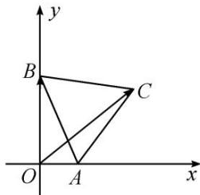

<!-- question-source:start -->
6. 如图, 线段 $AB$ 的长度为 2 , 点 $A$ , $B$ 分别在 $x$ 轴的正半轴和 $y$ 轴的正半轴上滑动, 以线段 $AB$ 为一边, 在第一象限内作等边三角形 $ABC$ , $O$ 为坐标原点, 则 $\overrightarrow{OC} \cdot \overrightarrow{OB}$ 的取值范围是 \_\_\_\_.

6.
<!-- question-source:end -->

![[高中/总复习/专题/平面向量/专题2 平面向量的数量积-平面向量/考点三_平面向量数量积的最值_范围_问题/对点训练/题目/answers/Q00033355A1.md]]
