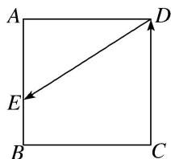

<!-- question-source:start -->
9. 如图所示, 已知正方形 $ABCD$ 的边长为 1 , 点 $E$ 从点 $D$ 出发, 按字母顺序 $D \to A \to B \to C$ 沿线段 $DA$ , $AB$ , $BC$ 运动到点 $C$ , 在此过程中 $\overrightarrow{DE} \cdot \overrightarrow{CD}$ 的取值范围为 \_\_\_\_.

9.
<!-- question-source:end -->

![[高中/总复习/专题/平面向量/专题2 平面向量的数量积-平面向量/考点三_平面向量数量积的最值_范围_问题/对点训练/题目/answers/Q00033358A1.md]]
