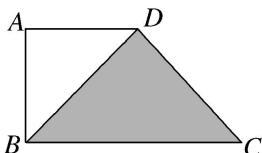

<!-- question-source:start -->
12. 如图，在直角梯形 $ABCD$ 中， $DA = AB = 1$ ， $BC = 2$ ，点 $P$ 在阴影区域(含边界)中运动，则 $\overrightarrow{PA} \cdot \overrightarrow{BD}$ 的取值范围是（）

A. $\left[-\frac{1}{2}, 1\right]$ B. $\left[-1, \frac{1}{2}\right]$ C. $[-1, 1]$ D. $[-1, 0]$

12.
<!-- question-source:end -->

![[高中/总复习/专题/平面向量/专题2 平面向量的数量积-平面向量/考点三_平面向量数量积的最值_范围_问题/对点训练/题目/answers/Q00033361A1.md]]
