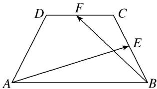

<!-- question-source:start -->
13. 如图，在等腰梯形 $ABCD$ 中，已知 $DC \parallel AB$ ， $\angle ADC = 120^{\circ}$ ， $AB = 4$ ， $CD = 2$ ，动点 $E$ 和 $F$ 分别在线

段 $BC$ 和 $DC$ 上，且 $\overrightarrow{BE} = \frac{1}{2\lambda}\overrightarrow{BC}$ ， $\overrightarrow{DF} = \lambda \overrightarrow{DC}$ ，则 $\overrightarrow{AE}\cdot \overrightarrow{BF}$ 的最小值是（

A. $4\sqrt{6} + 13$ B. $4\sqrt{6} - 13$ C. $4\sqrt{6} + \frac{13}{2}$ D. $4\sqrt{6} - \frac{13}{2}$

13.
<!-- question-source:end -->

![[高中/总复习/专题/平面向量/专题2 平面向量的数量积-平面向量/考点三_平面向量数量积的最值_范围_问题/对点训练/题目/answers/Q00033362A1.md]]
