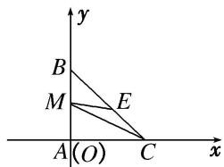

> [!faq]- 教师版对点训练解析
>
> > [!success]- **【答案】** B
>
> > [!note]- **【分析】**
> > 本题未单列分析。
>
> > [!note]- **【解析】**
> > 答案 B 解析 如图，以 A 为坐标原点，AC，AB 所在直线分别为 x 轴，y 轴建立平面直角坐标系，则 $A(0,0)$ ， $B(0,1)$ ， $C(1,0)$ ， $E\left(\frac{1}{2},\frac{1}{2}\right)$ 。设 $M(0,m)(0\leq m\leq1)$ ，则 $\overrightarrow{ME}=\left(\frac{1}{2},\frac{1}{2}-m\right)$ ， $\overrightarrow{MC}=(1,-m)$ 。 $\overrightarrow{ME}\cdot\overrightarrow{MC}=\frac{1}{2}-m\left(\frac{1}{2}-m\right)=m^{2}-\frac{1}{2}m+\frac{1}{2}=\left(m-\frac{1}{4}\right)^{2}+\frac{7}{16}$ ，由于 $m\in[0,1]$ ，则当 $m=\frac{1}{4}$ 时， $\overrightarrow{ME}\cdot\overrightarrow{MC}$ 取得最小值 $\frac{7}{16}$ ；当 m=1 时， $\overrightarrow{ME}\cdot\overrightarrow{MC}$ 取得最大值 1。所以 $\overrightarrow{ME}\cdot\overrightarrow{MC}$ 的取值范围是 $\left[\frac{7}{16},1\right]$ 。
> > 
