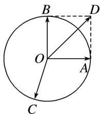

> [!faq]- 教师版对点训练解析
>
> > [!success]- **【答案】** A
>
> > [!note]- **【分析】**
> > 本题未单列分析。
>
> > [!note]- **【解析】**
> > 答案 A 解析 如图, 作出 $\overrightarrow{OD}$ , 使得 $\overrightarrow{OA} + \overrightarrow{OB} = \overrightarrow{OD}$ . 则 $(\overrightarrow{OC} - \overrightarrow{OA}) \cdot (\overrightarrow{OC} - \overrightarrow{OB}) = \overrightarrow{OC}^2 - \overrightarrow{OA} \cdot \overrightarrow{OC} - \overrightarrow{OB} \cdot \overrightarrow{OC} + \overrightarrow{OA} \cdot \overrightarrow{OB} = 1 - (\overrightarrow{OA} + \overrightarrow{OB}) \cdot \overrightarrow{OC} = 1 - \overrightarrow{OD} \cdot \overrightarrow{OC}$ , 由图可知, 当点 $C$ 在 $OD$ 的反向延长线与圆 $O$ 的交点处时， $\overrightarrow{OD} \cdot \overrightarrow{OC}$ 取得最小值，最小值为 $-\sqrt{2}$ ，此时 $(\overrightarrow{OC} - \overrightarrow{OA}) \cdot (\overrightarrow{OC} - \overrightarrow{OB})$ 取得最大值，最大值为 $1 + \sqrt{2}$ 。故选A.
> > 
