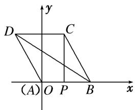

> [!faq]- 教师版例题解析
>
> > [!success]- **【答案】** A
>
> > [!note]- **【分析】**
> > 本题未单列分析。
>
> > [!note]- **【解析】**
> > 答案 B 解析 依题意得 $\overrightarrow{AE} = \overrightarrow{AB} +\overrightarrow{BE} = \frac{1}{2}\overrightarrow{BC} -\overrightarrow{BA}$ ， $\overrightarrow{BF} = \overrightarrow{BC} +\frac{1}{\lambda}\overrightarrow{BA}$ ，因此 $\overrightarrow{AE}\cdot \overrightarrow{BF} = (\frac{1}{2}\overrightarrow{BC} -\overrightarrow{BA})(\overrightarrow{BC}+$ $\frac{1}{\lambda}\overrightarrow{BA}) = \frac{1}{2}\overrightarrow{BC}^2 -\frac{1}{\lambda}\overrightarrow{BA}^2 +\left(\frac{1}{2\lambda} -1\right)\overrightarrow{BC}\cdot \overrightarrow{BA}$ ，于是有 $\left(\frac{1}{2} -\frac{1}{\lambda}\right)\times 6^2 +\left(\frac{1}{2\lambda} -1\right)\times 6^2\times \cos 60^\circ = -9.$ 由此解得 $\lambda = 3$ ，故选B. (4)已知菱形ABCD边长为2， $\angle B = \frac{\pi}{3}$ 点 $P$ 满足 $\overrightarrow{AP} = \lambda \overrightarrow{AB},\lambda \in \mathbf{R}$ ，若 $\overrightarrow{BD}\cdot \overrightarrow{CP} = -3$ ，则 $\lambda$ 的值为（）A. $\frac{1}{2}$ B. $-\frac{1}{2}$ C. $\frac{1}{3}$ D. $-\frac{1}{3}$
> > 答案 A 解析 法一：由题意可得 $\overrightarrow{BA} \cdot \overrightarrow{BC} = 2 \times 2\cos \frac{\pi}{3} = 2$ ， $\overrightarrow{BD} \cdot \overrightarrow{CP} = (\overrightarrow{BA} + \overrightarrow{BC}) \cdot (\overrightarrow{BP} - \overrightarrow{BC}) = (\overrightarrow{BA} + \overrightarrow{BC}) \cdot [(\overrightarrow{AP} - \overrightarrow{AB}) - \overrightarrow{BC}] = (\overrightarrow{BA} + \overrightarrow{BC}) \cdot [(\lambda - 1) \cdot \overrightarrow{AB} - \overrightarrow{BC}] = (1 - \lambda)\overrightarrow{BA}^2 - \overrightarrow{BA} \cdot \overrightarrow{BC} + (1 - \lambda)\overrightarrow{BA} \cdot \overrightarrow{BC} - \overrightarrow{BC}^2 = (1 - \lambda) \cdot 4 - 2 + 2(1 - \lambda) - 4 = -6\lambda = -3$ ， $\therefore \lambda = \frac{1}{2}$ ，故选 A.
> > 
> > 法二：建立如图所示的平面直角坐标系，则 $B(2,0), C(1,\sqrt{3}), D(-1,\sqrt{3})$ 。令 $P(x,0)$ ，由 $\overrightarrow{BD} \cdot \overrightarrow{CP} = (-3, \sqrt{3}) \cdot (x - 1, -\sqrt{3}) = -3x + 3 - 3 = -3x = -3$ 得 $x = 1$ 。 $\because \overrightarrow{AP} = \lambda \overrightarrow{AB}, \therefore \lambda = \frac{1}{2}$ 。
> >
> > 故选 **A**.
