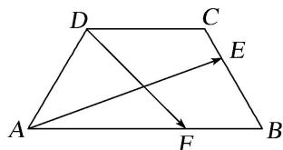

<!-- question-source:start -->
(6)如图，在等腰梯形ABCD中， $AB = 4$ ， $BC = CD = 2$ ，若 $E$ ， $F$ 分别是边BC， $AB$ 上的点，且满足 $\frac{BE}{BC}$ $= \frac{AF}{AB} = \lambda$ ，则当 $\overrightarrow{AE}\cdot \overrightarrow{DF} = 0$ 时， $\lambda$ 的值所在的区间是（）

A. $\left(\frac{1}{8},\frac{1}{4}\right)$ B. $\left(\frac{1}{4},\frac{3}{8}\right)$ C. $\left(\frac{3}{8},\frac{1}{2}\right)$ D. $\left(\frac{1}{2},\frac{5}{8}\right)$
<!-- question-source:end -->

![[高中/总复习/专题/平面向量/专题3 平面向量的平行与垂直-平面向量/考点02_两个非零向量的垂直/例题/answers/Q00045207A1.md]]
