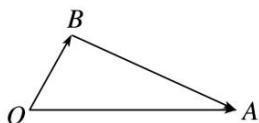

> [!faq]- 教师版例题解析
>
> > [!success]- **【答案】** B
>
> > [!note]- **【分析】**
> > 本题未单列分析。
>
> > [!note]- **【解析】**
> > 答案 B 解析 答案 B 解析 方法一 设 a 与 b 的夹角为 $\theta$ ，因为 $(a-b)\perp b$ ，所以 $(a-b)\cdot b=a\cdot b-|b|^{2}=0$ ，又因为 $|a|=2|b|$ ，所以 $2|b|^{2}\cos\theta-|b|^{2}=0$ ，即 $\cos\theta=\frac{1}{2}$ ，又 $\theta\in[0,\pi]$ ，所以 $\theta=\frac{\pi}{3}$ ，故选 B.
> > $$
> > \overrightarrow {O A} = a
> > $$
> > $$
> > \overrightarrow {O B} = \boldsymbol {b}
> > $$
> > $$
> > \overrightarrow {B A} = \overrightarrow {O A} - \overrightarrow {O B} = a - b
> > $$
> > 
> > 因为 $(a-b)\perp b$ ，所以 $\angle OBA=\frac{\pi}{2}$ ，又 $|a|=2|b|$ ，所以 $\angle AOB=\frac{\pi}{3}$ ，即a与b的夹角为 $\frac{\pi}{3}$ ，
> >
> > 故选 **B**.
