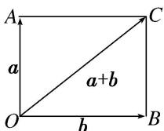

> [!faq]- 教师版例题解析
>
> > [!success]- **【答案】** B
>
> > [!note]- **【分析】**
> > 本题未单列分析。
>
> > [!note]- **【解析】**
> > 答案 B 解析 $\because |2a + b|^2 = 4|a|^2 + 4a \cdot b + |b|^2 = 7, |a| = 1, |b| = \sqrt{3}, \therefore 4 + 4a \cdot b + 3 = 7, \therefore a \cdot b = 0, \therefore a \perp b$ . 如图所示， $a$ 与 $a + b$ 的夹角为 $\angle COA$ . $\because \tan \angle COA = \frac{|CA|}{|OA|} = \frac{|b|}{|a|} = \sqrt{3}, \therefore \angle COA = \frac{\pi}{3}$ ，即 $a$ 与 $a + b$ 的夹角为 $\frac{\pi}{3}$ .
> > 
