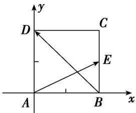

> [!faq]- 教师版例题解析
>
> > [!success]- **【答案】** 详见解析
>
> > [!note]- **【分析】**
> > 本题未单列分析。
>
> > [!note]- **【解析】**
> > 答案 $-\frac{\sqrt{10}}{10}$ 解析 因为 $2\overrightarrow{BE}=\overrightarrow{BC}$ ，所以E为BC中点。设正方形的边长为2，则 $|\overrightarrow{AE}|=\sqrt{5},|\overrightarrow{BD}|=2\sqrt{2},\overrightarrow{AE}\cdot\overrightarrow{BD}=\left(\overrightarrow{AB}+\frac{1}{2}\overrightarrow{AD}\right)\cdot(\overrightarrow{AD}-\overrightarrow{AB})=\frac{1}{2}|\overrightarrow{AD}|^{2}-|\overrightarrow{AB}|^{2}+\frac{1}{2}\overrightarrow{AD}\cdot\overrightarrow{AB}=\frac{1}{2}\times2^{2}-2^{2}=-2$ ，所以 $\cos\theta=\frac{\overrightarrow{AE}\cdot\overrightarrow{BD}}{|\overrightarrow{AE}||\overrightarrow{BD}|}=\frac{-2}{\sqrt{5}\times2\sqrt{2}}=-\frac{\sqrt{10}}{10}$ 。
> > 优解：因为 $2\overrightarrow{BE} = \overrightarrow{BC}$ ，所以E为BC中点．设正方形的边长为2，建立如图所示的平面直角坐标系 $xAy$ ，则点 $A(0,0)$ ， $B(2,0)$ ， $D(0,2)$ ，E(2,1)，所以 $\overrightarrow{AE} = (2,1)$ ， $\overrightarrow{BD} = (-2,2)$ ，所以 $\overrightarrow{AE} \cdot \overrightarrow{BD} = 2 \times (-2) + 1 \times 2 = -2$ ，故 $\cos \theta = \frac{\overrightarrow{AE} \cdot \overrightarrow{BD}}{|\overrightarrow{AE}||\overrightarrow{BD}|} = \frac{-2}{\sqrt{5 \times 2\sqrt{2}}} = -\frac{\sqrt{10}}{10}$ .
> > 
