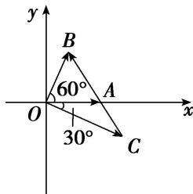

> [!faq]- 教师版例题解析
>
> > [!success]- **【答案】** 详见解析
>
> > [!note]- **【分析】**
> > 本题未单列分析。
>
> > [!note]- **【解析】**
> > 答案2解析解法1因为向量 $a, b$ 为单位向量, 所以 $b^{2} = 1$ , 又向量 $a, b$ 的夹角为 $60^{\circ}$ , 所以 $a \cdot b = \frac{1}{2}$ , 由 $b \cdot c = 0$ 得 $b \cdot [ta + (1 - t)b] = 0$ , 即 $ta \cdot b + (1 - t)b^{2} = 0$ , 所以 $\frac{1}{2} t + (1 - t) = 0$ , 所以 $t = 2$ .
> > 解法2 由 $t + (1 - t) = 1$ 知向量 $\pmb{a}$ 、 $\pmb{b}$ 、 $\pmb{c}$ 的终点 $A$ 、 $B$ 、 $C$ 共线，在平面直角坐标系中设 $a = (1,0)$ ， $\pmb{b} = \left(\frac{1}{2}, \frac{\sqrt{3}}{2}\right)$ ，则 $c = \left(\frac{3}{2}, -\frac{\sqrt{3}}{2}\right)$ . 把 $\pmb{a}$ 、 $\pmb{b}$ 、 $\pmb{c}$ 的坐标代入 $c = ta + (1 - t)b$ ，得 $t = 2$ .
> > 
