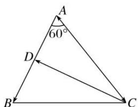

> [!faq]- 《专题5 平面向量的模-平面向量》例题解析
>
> > [!success]- **【答案】** C
>
> > [!note]- **【分析】**
> > 本题未单列分析。
>
> > [!note]- **【解析】**
> > 答案 C 解析 如图所示，
> >
> > 
> >
> > 设 $\overrightarrow{AD} = k\overrightarrow{AB}$ ，所以 $\overrightarrow{CD} = \overrightarrow{AD} -\overrightarrow{AC} = k\overrightarrow{AB} -\overrightarrow{AC}$ ，所以 $\overrightarrow{AB}\cdot \overrightarrow{CD} = \overrightarrow{AB}\cdot (k\overrightarrow{AB} -\overrightarrow{AC}) = k\overrightarrow{AB}^2 -\overrightarrow{AB}\cdot \overrightarrow{AC} = 25k-$
> >
> > $5 \times 6 \times \frac{1}{2} = 25k - 15 = -5$ ，解得 $k = \frac{2}{5}$ ，所以 $|\overrightarrow{BD}| = \left(1 - \frac{2}{5}\right)|\overrightarrow{AB}| = 3$ .
