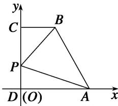

> [!faq]- 《专题5 平面向量的模-平面向量》例题解析
>
> > [!success]- **【答案】** 详见解析
>
> > [!note]- **【解析】**
> > 答案 5 解析 方法一 以 D 为原点，分别以 DA、DC 所在直线为 x、y 轴建立如图所示的平面直角坐标系，设 DC=a，DP=x. $\therefore D(0,0)$ ， $A(2,0)$ ， $C(0,a)$ ， $B(1,a)$ ， $P(0,x)$ ，
> >
> > 
> >
> > $\overrightarrow{PA} = (2, -x), \overrightarrow{PB} = (1, a - x), \therefore \overrightarrow{PA} + 3\overrightarrow{PB} = (5, 3a - 4x), |\overrightarrow{PA} + 3\overrightarrow{PB}|^2 = 25 + (3a - 4x)^2 \geqslant 25, \therefore |\overrightarrow{PA} + 3\overrightarrow{PB}|$ 的最小值为5.
> >
> > 方法二 设 $\overrightarrow{DP} = x\overrightarrow{DC}(0 < x < 1)$ . $\therefore \overrightarrow{PC} = (1 - x)\overrightarrow{DC}$ , $\overrightarrow{PA} = \overrightarrow{DA} - \overrightarrow{DP} = \overrightarrow{DA} - x\overrightarrow{DC}$ , $\overrightarrow{PB} = \overrightarrow{PC} + \overrightarrow{CB} = (1 - x)\overrightarrow{DC} + \frac{1}{2}\overrightarrow{DA}$ . $\therefore \overrightarrow{PA} + 3\overrightarrow{PB} = \frac{5}{2}\overrightarrow{DA} + (3 - 4x)\overrightarrow{DC}$ , $|\overrightarrow{PA} + 3\overrightarrow{PB}|^2 = \frac{25}{4}\overrightarrow{DA}^2 + 2 \times \frac{5}{2} \times (3 - 4x)\overrightarrow{DA} \cdot \overrightarrow{DC} + (3 - 4x)^2 \cdot \overrightarrow{DC}^2 = 25 + (3 - 4x)^2\overrightarrow{DC}^2 \geqslant 25$ , $\therefore |\overrightarrow{PA} + 3\overrightarrow{PB}|$ 的最小值为 5.
