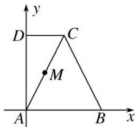

> [!faq]- 《专题5 平面向量的模-平面向量》例题解析
>
> > [!success]- **【答案】** 详见解析
>
> > [!note]- **【分析】**
> > 本题未单列分析。
>
> > [!note]- **【解析】**
> > 答案 $\left[\frac{2\sqrt{5}}{5}, 2\sqrt{2}\right]$ 解析 以 $A$ 为坐标原点， $AB$ ， $AD$ 所在直线分别为 $x$ 轴， $y$ 轴，建立如图所示的平面直角坐标系，
> > 
> > 则 $A(0,0)$ ， $B(2,0)$ ， $C(1,2)$ ， $D(0,2)$ ，设 $\overrightarrow{AM} = \lambda \overrightarrow{AC} (0 \leq \lambda \leq 1)$ ，则 $M(\lambda, 2\lambda)$ ，故 $\overrightarrow{MD} = (-\lambda, 2 - 2\lambda)$ ， $\overrightarrow{MB} = (2 - \lambda, -2\lambda)$ ，则 $\overrightarrow{MB} + \overrightarrow{MD} = (2 - 2\lambda, 2 - 4\lambda)$ ， $\therefore |\overrightarrow{MB} + \overrightarrow{MD}| = \sqrt{(2 - 2\lambda)^2 + (2 - 4\lambda)^2} = \sqrt{20\left[\frac{\lambda - \frac{3}{5}}{5}\right]^2 + \frac{4}{5}}$ ， $0 \leq \lambda \leq 1$ ，当 $\lambda = 0$ 时， $|\overrightarrow{MB} + \overrightarrow{MD}|$ 取得最大值为 $2\sqrt{2}$ ，当 $\lambda = \frac{3}{5}$ 时， $|\overrightarrow{MB} + \overrightarrow{MD}|$ 取得最小值为 $\frac{2\sqrt{5}}{5}$ ， $\therefore |\overrightarrow{MB} + \overrightarrow{MD}| \in [\frac{2\sqrt{5}}{5}, 2\sqrt{2}]$ .
