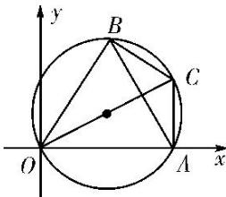

> [!faq]- 《专题5 平面向量的模-平面向量》例题解析
>
> > [!success]- **【答案】** 详见解析
>
> > [!note]- **【解析】**
> > 答案 $\frac{2\sqrt{3}}{3}$ 解析 $\overrightarrow{OA} = a, \overrightarrow{OB} = b$ ，则 $\overrightarrow{BA} = a - b$ 。因为非零向量 $a, b, c$ 满足 $|a| = |b| = |a - b|$ ，所以 $\triangle OAB$ 是等边三角形。设 $\overrightarrow{OC} = c$ ，则 $\overrightarrow{AC} = c - a, \overrightarrow{BC} = c - b$ 。因为 $<c - a, c - b> = \frac{2\pi}{3}$ ，所以点 $C$ 在 $\triangle ABC$ 的外接圆上，所以当 $OC$ 为 $\triangle ABC$ 的外接圆的直径时， $\frac{|c|}{|a|}$ 取得最大值，为 $\frac{1}{\cos 30^\circ} = \frac{2\sqrt{3}}{3}$ 。
> >
> > 
