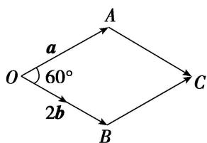

> [!faq]- 教师版例题解析
>
> > [!success]- **【答案】** 详见解析
>
> > [!note]- **【分析】**
> > 本题未单列分析。
>
> > [!note]- **【解析】**
> > 答案 $2\sqrt{3}$ 解析 解法1 $|a + 2b| = \sqrt{(a + 2b)^2} = \sqrt{a^2 + 4a \cdot b + 4b^2} = \sqrt{2^2 + 4 \times 2 \times 1 \times \cos 60^\circ + 4 \times 1^2} = \sqrt{12} = 2\sqrt{3}$ .
> > 解法2 (数形结合法)由 $|a| = |2b| = 2$ ，知以 $\pmb{a}$ 与 $2b$ 为邻边可作出边长为2的菱形OACB，如图，则 $|a + 2b| = |\overrightarrow{OC}|$ .又 $\angle AOB = 60^{\circ}$ ，所以 $|a + 2b| = 2\sqrt{3}$
> > 
