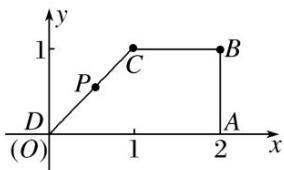

> [!faq]- 教师版对点训练解析
>
> > [!success]- **【答案】** 详见解析
>
> > [!note]- **【分析】**
> > 本题未单列分析。
>
> > [!note]- **【解析】**
> > 答案 $\frac{5\sqrt{2}}{2}$ 解析 以 $D$ 为坐标原点， $DA$ 为 $x$ 轴，过 $D$ 与 $DA$ 垂直的直线为 $y$ 轴，建立平面直角坐标系，
> > 
> > 由 $AD \parallel BC$ ， $\angle BAD = 90^\circ$ ， $\angle ADC = 45^\circ$ ， $AD = 2$ ， $BC = 1$ ，可得 $D(0,0)$ ， $A(2,0)$ ， $B(2,1)$ ， $C(1,1)$ ， $\because P$ 在 $CD$ 上， $\therefore$ 可设 $P(t, t) (0 \leqslant t \leqslant 1)$ ，则 $\overrightarrow{PA} = (2 - t, -t)$ ， $\overrightarrow{BP} = (t - 2, t - 1)$ ， $3\overrightarrow{PA} + \overrightarrow{BP} = (4 - 2t, -2t - 1)$ ， $\therefore |3\overrightarrow{PA} + \overrightarrow{BP}| = \sqrt{(4 - 2t)^2 + (-2t - 1)^2} = \sqrt{8\left(t - \frac{3}{4}\right)^2 + \frac{25}{2}} \geqslant \sqrt{\frac{25}{2}} = \frac{5\sqrt{2}}{2}$ （当 $t = \frac{3}{4}$ 时，等号成立），即 $|3\overrightarrow{PA} + \overrightarrow{BP}|$ 的最小值为 $\frac{5\sqrt{2}}{2}$ .
