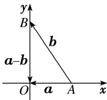

> [!faq]- 教师版对点训练解析
>
> > [!success]- **【答案】** 详见解析
>
> > [!note]- **【分析】**
> > 本题未单列分析。
>
> > [!note]- **【解析】**
> > 答案 $\frac{\sqrt{7}}{2}$ 解析 向量 $a, b$ 夹角为 $\frac{\pi}{3}$ , $|b| = 2$ , 对任意 $x \in \mathbf{R}$ , 有 $|b + xa| \geq |a - b|$ , 两边平方整理可得 $x^2 a^2 + 2xa \cdot b - (a^2 - 2a \cdot b) \geq 0$ , 则 $\Delta = 4(a \cdot b)^2 + 4a^2 (a^2 - 2a \cdot b) \leq 0$ , 即有 $(a^2 - a \cdot b)^2 \leq 0$ , 即为 $a^2 = a \cdot b$ , 则 $(a - b) \perp a$ , 由向量 $a, b$ 夹角为 $\frac{\pi}{3}$ , $|b| = 2$ , 由 $a^2 = a \cdot b = |a| \cdot |b| \cdot \cos \frac{\pi}{3}$ , 得 $|a| = 1$ , 则 $|a - b| = \sqrt{a^2 + b^2 - 2a \cdot b} = \sqrt{3}$ ,
> > 
> > 画出 $\overrightarrow{AO} = a, \overrightarrow{AB} = b$ ，建立平面直角坐标系，如图所示：则 $A(1,0), B(0, \sqrt{3})$ ， $\therefore a = (-1,0), b = (-1, \sqrt{3})$ ； $\therefore |tb - a| + \left|t b - \frac{a}{2}\right| = \sqrt{(1 - t)^2 + (\sqrt{3} t)^2} + \sqrt{\left(\frac{1}{2} - t\right)_2 + (\sqrt{3} t)^2} = \sqrt{4t^2 - 2t + 1} + \sqrt{4t^2 - t + \frac{1}{4}} = 2\left[\sqrt{\left(t - \frac{1}{4}\right)_2 + \left(0 - \frac{\sqrt{3}}{4}\right)_2} + \sqrt{\left(t - \frac{1}{8}\right)_2 + \left(0 + \frac{\sqrt{3}}{8}\right)_2}\right]$ 表示 $P(t,0)$ 与 $M\left(\frac{1}{4}, \frac{\sqrt{3}}{4}\right), N\left(\frac{1}{8}, -\frac{\sqrt{3}}{8}\right)$ 的距离之和的 2 倍，当 $M, P, N$ 共线时，取得最小值 $2|M N|$ 。即有 $2|M N| = 2\sqrt{\left(\frac{1}{4} - \frac{1}{8}\right)_2 + \left(\frac{\sqrt{3}}{4} + \frac{\sqrt{3}}{8}\right)_2} = \frac{\sqrt{7}}{2}$ 。
