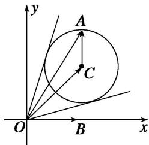

> [!faq]- 《专题6 平面向量与三角函数-平面向量》例题解析
>
> > [!success]- **【答案】** D
>
> > [!note]- **【分析】**
> > 本题未单列分析。
>
> > [!note]- **【解析】**
> > 答案 D 解析 由题意，得： $\overrightarrow{OA}=\overrightarrow{OC}+\overrightarrow{CA}=(2+\sqrt{2}\cos\alpha,2+\sqrt{2}\sin\alpha)$ ，所以点 A 的轨迹是圆 $(x-2)^{2}+(y-2)^{2}=2$ ，如图，当 A 位于使向量 $\overrightarrow{OA}$ 与圆相切时，向量 $\overrightarrow{OA}$ 与向量 $\overrightarrow{OB}$ 的夹角分别达到最大、最小值，故选 D.
> > 
