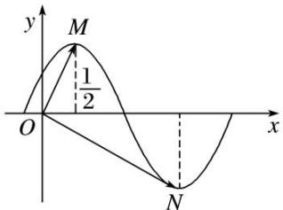

<!-- question-source:start -->
14. 函数 $y = \sin (\omega x + \varphi)$ 在一个周期内的图象如图所示， $M, N$ 分别是最高点、最低点， $O$ 为坐标原点，且 $\overrightarrow{OM} \cdot \overrightarrow{ON} = 0$ ，则函数 $f(x)$ 的最小正周期是 \_\_\_\_.

<!-- question-source:end -->

![[高中/总复习/专题/平面向量/专题6 平面向量与三角函数-平面向量/考点01_平面向量与三角函数选填题/对点训练/answers/Q00045313A1.md]]
