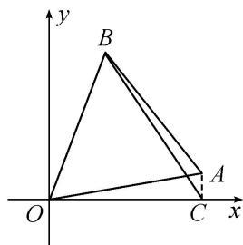

> [!faq]- 《专题6 平面向量与三角函数-平面向量》例题解析
>
> > [!success]- **【答案】** 详见解析
>
> > [!note]- **【分析】**
> > 本题未单列分析。
>
> > [!note]- **【解析】**
> > (1) 试将 $\overrightarrow{OA} \cdot \overrightarrow{CB}$ 表示为 $\alpha$ 的函数 $f(\alpha)$ ，并写出其定义域；
> > (2) 求函数 $f(\alpha)$ 的值域.
> > 
> > 13. 解析
> > (1)由条件知， $A(\cos \alpha, \sin \alpha)$ ， $C(\cos \alpha, 0)$ ， $B(\cos (\alpha + 60^\circ), \sin (\alpha + 60^\circ))$ .
> > 所以 $\overrightarrow{OA}=(\cos\alpha,\sin\alpha)$ ， $\overrightarrow{CB}=(\cos(\alpha+60^{\circ})-\cos\alpha,\sin(\alpha+60^{\circ}))$
> > 所以 $\overrightarrow{OA} \cdot \overrightarrow{CB} = \cos \alpha \cdot [\cos (\alpha + 60^\circ) - \cos \alpha] + \sin \alpha \cdot \sin (\alpha + 60^\circ)$
> > $= \cos \alpha \cdot \cos (\alpha + 60^{\circ}) + \sin \alpha \cdot \sin (\alpha + 60^{\circ}) - \cos^{2} \alpha$ $= \cos [(\alpha + 60^{\circ}) - \alpha] - \cos^{2} \alpha = \frac{1}{2} - \cos^{2} \alpha = \frac{1}{2} - \frac{1 + \cos 2\alpha}{2} = -\frac{1}{2} \cos 2\alpha,$
> > 所以 $f(\alpha)=-\frac{1}{2}\cos2\alpha$ ，其定义域为 $(0,\frac{\pi}{6})$ .
> > (2)因为 $\alpha \in (0, \frac{\pi}{6})$ ，所以 $2\alpha \in (0, \frac{\pi}{3})$ ， $\cos 2\alpha \in (\frac{1}{2}, 1)$ ，所以 $-\frac{1}{2}\cos 2\alpha \in (-\frac{1}{2}, -\frac{1}{4})$
> > 即函数 $f(\alpha)$ 的值域为 $(- \frac{1}{2}, -\frac{1}{4})$ .
