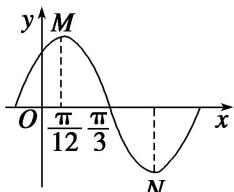

<!-- question-source:start -->
(7)若函数 $y=A\sin(\omega x+\varphi)(A>0,\quad\omega>0,\quad|\varphi|<\frac{\pi}{2})$ 在一个周期内的图象如图所示，M，N 分别是这段图象的最高点和最低点，且 $\overrightarrow{OM}\cdot\overrightarrow{ON}=0$ (O 为坐标原点)，则 A 等于()

A. $\frac{\pi}{6}$ B. $\frac{\sqrt{7}}{12}\pi$ C. $\frac{\sqrt{7}}{6}\pi$ D. $\frac{\sqrt{7}}{3}\pi$
<!-- question-source:end -->

![[高中/总复习/专题/平面向量/专题6 平面向量与三角函数-平面向量/考点一_平面向量与三角函数选填题/例题选讲/例题/answers/Q00033372A1.md]]
