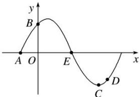

<!-- question-source:start -->
15. 已知 $A, B, C, D$ 是函数 $y = \sin (\omega x + \varphi)\left[\omega > 0, 0 < \varphi < \frac{\pi}{2}\right]$ 一个周期内的图象上的四个点，如图所示， $A\left[-\frac{\pi}{6}, 0\right], B$ 为 $y$ 轴上的点， $C$ 为图象上的最低点， $E$ 为该函数图象的一个对称中心， $B$ 与 $D$ 关于点 $E$ 对称，由 $\overrightarrow{CD}$ 在 $x$ 轴上的投影为 $\frac{\pi}{12} \frac{\overrightarrow{CD}}{|\overrightarrow{CD}|}$ ，则 $\omega, \varphi$ 的值为（）

A. $\omega = 2$ ， $\varphi = \frac{\pi}{3}$ B. $\omega = 2$ ， $\varphi = \frac{\pi}{6}$ C. $\omega = \frac{1}{2}$ ， $\varphi = \frac{\pi}{3}$ D. $\omega = \frac{1}{2}$ ， $\varphi = \frac{\pi}{6}$

15.
<!-- question-source:end -->

![[高中/总复习/专题/平面向量/专题6 平面向量与三角函数-平面向量/考点一_平面向量与三角函数选填题/对点训练/题目/answers/Q00033388A1.md]]
